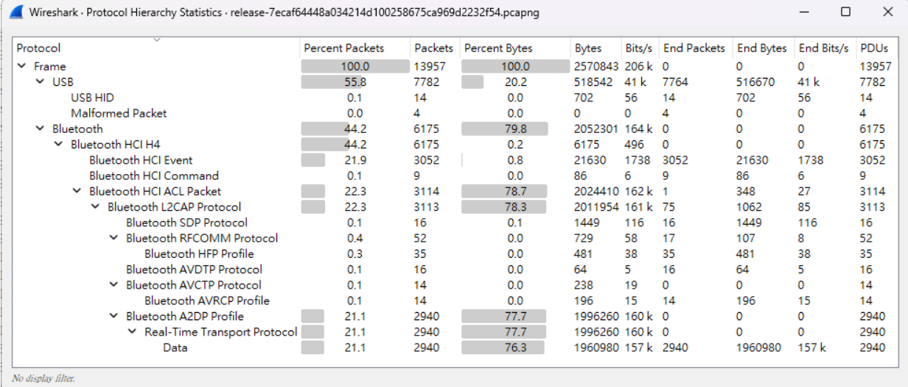
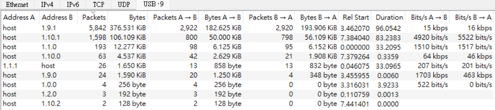
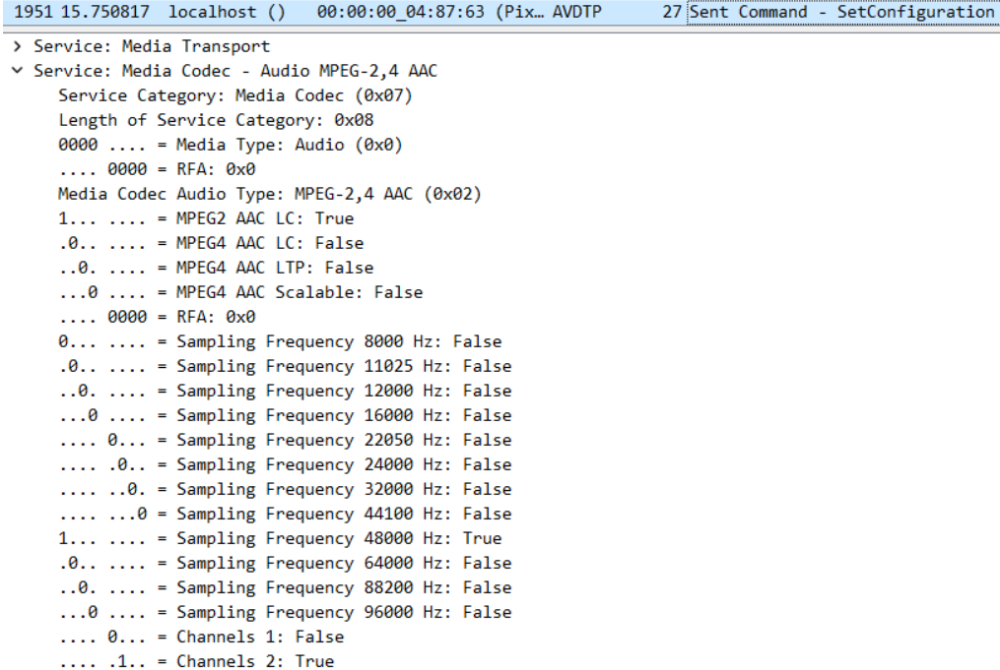
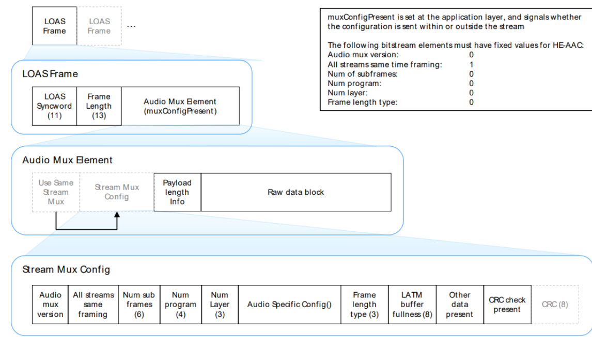

# Not Just usbpcap
- Tags: `forensics`
- Score: 277/500
- Solves: 22

## Description
I recorded one's USB traffic on his computer, can you find the hidden secret?  
[release.pcapng](release/release-7ecaf64448a034214d100258675ca969d2232f54.pcapng)

## Overview
Topics: `usbhid`, `bluetooth audio`

The pcap file contains the traffic captured on three interfaces (bluetooth0, usbmon0, usbmon1).

Flag format is in keyboard USB traffic.
Flag content is in bluetooth A2DP traffic.

## Solution



Trong tệp pcap này, bạn cần tìm thông tin ẩn dấu trong lưu lượng USB và Bluetooth. Đầu tiên, hãy xem xét lưu lượng USB.

### USB HID

Bạn có thể sử dụng bộ lọc usb.transfer_type == 2 && usb.bDescriptorType == 4 && usb.bInterfaceClass == 3 để tìm DESCRIPTOR CẤU HÌNH tương ứng của chúng, và kiểm tra bInterfaceProtocol trong DESCRIPTOR GIAO DIỆN để xác định loại thiết bị (1 cho bàn phím, 2 cho chuột). Chi tiết về cách xác định loại thiết bị này có trong [Device Class Definition for HID 1.11](https://www.usb.org/document-library/device-class-definition-hid-111) - 4.3 Protocol.

Bằng cách trích xuất các phím bàn phím ([parse_keyboard.py](https://github.com/KMANVK/hitcon-ctf-2023/blob/main/Foren/Not%20just%20pcap/parse_keyboard.py))<sup>1</sup>, và chúng ta nhận được nội dung như sau :
```
radio.chal.hitconctf.com


Sorry, no flag here. Try harder.
But i can tell you that the flag format is hitcon{lower-case-english-separated-with-dash}
Again, this is not the flag :(

C8763!
```

Bây giờ bạn đã có được định dạng cờ. Ngoài ra, radio.chal.hitconctf.com cũng đóng vai trò là gợi ý rằng bạn nên xem xét gói tin âm thanh. Đây cũng là một trang web có thể xem được  (backup: http://hitcon-radio.pages.dev).

### Bluetooth Audio

Trước khi bắt đầu giải mã âm thanh, bạn nên xác định xem mã hóa nào đã được sử dụng. Với cấu hình AVDTP, bạn có thể thấy rằng codec là MPEG-2 AAC LC với 48000 Hz, stereo. 

Dữ liệu âm thanh được đặt trong một luồng RTP, bạn có thể kiểm tra [RFC6416 RTP Payload Format for MPEG-4 Audio/Visual Streams](https://datatracker.ietf.org/doc/html/rfc6416) - 6.1 RTP Packet Format for the detail.  
Mỗi gói RTP có cấu trúc như sau :
```
 0                   1                   2                   3
 0 1 2 3 4 5 6 7 8 9 0 1 2 3 4 5 6 7 8 9 0 1 2 3 4 5 6 7 8 9 0 1
+-+-+-+-+-+-+-+-+-+-+-+-+-+-+-+-+-+-+-+-+-+-+-+-+-+-+-+-+-+-+-+-+
|V=2|P|X|  CC   |M|     PT      |       sequence number         |RTP
+-+-+-+-+-+-+-+-+-+-+-+-+-+-+-+-+-+-+-+-+-+-+-+-+-+-+-+-+-+-+-+-+
|                           timestamp                           |Header
+-+-+-+-+-+-+-+-+-+-+-+-+-+-+-+-+-+-+-+-+-+-+-+-+-+-+-+-+-+-+-+-+
|           synchronization source (SSRC) identifier            |
+=+=+=+=+=+=+=+=+=+=+=+=+=+=+=+=+=+=+=+=+=+=+=+=+=+=+=+=+=+=+=+=+
|            contributing source (CSRC) identifiers             |
|                             ....                              |
+=+=+=+=+=+=+=+=+=+=+=+=+=+=+=+=+=+=+=+=+=+=+=+=+=+=+=+=+=+=+=+=+
|                                                               |RTP
:                 audioMuxElement (byte aligned)                :Payload
|                                                               |
|                               +-+-+-+-+-+-+-+-+-+-+-+-+-+-+-+-+
|                               :...OPTIONAL RTP padding        |
+-+-+-+-+-+-+-+-+-+-+-+-+-+-+-+-+-+-+-+-+-+-+-+-+-+-+-+-+-+-+-+-+
```

Trong RFC6416, cũng đã đề cập rằng Luồng âm thanh MPEG-4 PHẢI được định dạng thành các luồng LATM (Low-overhead MPEG-4 Audio Transport Multiplex), được định nghĩa trong ISO/IEC 14496-3.  

Việc giải mã cho LATM có chút phức tạp trong tài liệu ISO. Đối với sự đơn giản, biểu đồ trong [MPEG-4: Audio - White paper on AAC Transport Formats](https://www.mpeg.org/standards/MPEG-4/3/) dễ hiểu hơn về cấu trúc LATM.


FFmpeg của tôi không thể giải mã các luồng LATM trực tiếp. Bằng cách kiểm tra [ffmpeg source code](https://github.com/FFmpeg/FFmpeg/blob/67cc7aaa51fcd781ac5920d3c739e28c81cbb0cb/libavcodec/aacdec.c#L481-L501), FFmpeg hỗ trợ LATM, nhưng nó yêu cầu tiêu đề LOAS. Vì vậy, để giải mã luồng LATM, bạn có thể đơn giản là thêm tiêu đề LOAS vào mỗi AudioMuxElement, điều này làm cho nó có thể đọc được bằng thư viện libavcodec của FFmpeg.  

Bắt các gói tin bằng bộ lọc rtp (hoặc a2dp) qua Wireshark -> Xuất gói tin cụ thể, sau đó chạy [acc.py](https://github.com/KMANVK/hitcon-ctf-2023/blob/main/Foren/Not%20just%20pcap/acc.py) để tạo luồng LOAS.

Luồng LOAS có thể được chuyển đổi bằng ffmpeg -i radio.loas radio.wav hoặc phát trực tiếp bằng VLC.

Âm thanh có nội dung sau:

```
Welcome back to "Secret Flags Unveiled" on HITCON Radio! I'm John, your host for this intriguing journey into the world of secret flags.

Today, we'll explore the secret flag, where flag served as vital information for scoring in CTFs.

The secret flags are crucial to the success of HITCON CTF, and one of them is going to be revealed. Listen carefully, you get only one chance.

Flag start.
secret flags unveiled with bluetooth radio.
Flag end.

Just simply wrap the text you heard with the flag format. If you find some information missing, just dig deeper in the packet.

Stay tuned for more secret flags. This is John, signing off from "Secret Flags Unveiled" on HITCON Radio. Keep those flags flying high!
```

Bên cạnh đó, FFmpeg cũng nhận biết được AAC được đóng gói trong luồng ADTS, vì vậy bạn có thể thay thế tiêu đề LATM bằng tiêu đề ADTS tương ứng. Xem [stackoverflow post](https://stackoverflow.com/questions/35915317/decode-mpeg-2-4-aac-lc-latm-bitstream-for-a2dp), có thể tìm thấy khi tìm kiếm \x47\xfc\x00\x00 (byte đầu tiên cho StreamMuxConfig) hoặc decode MPEG 2,4 AAC LC LATM. Tuy nhiên, âm thanh sẽ có tiếng ồn khi sử dụng phương pháp này.

## Flag

`hitcon{secret-flags-unveiled-with-bluetooth-radio}`
